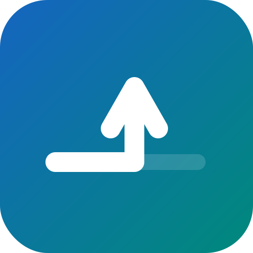

<!-- markdownlint-disable MD033 MD041 -->
<p align="center">
  <a href="https://github.com/Bdaya-Dev/redirect">
    
  </a>
</p>

<h1 align="center">redirect</h1>

<p align="center">
  A cross-platform Dart &amp; Flutter plugin for redirect-based flows — OAuth, OIDC, payment gateways, and more.
</p>

<p align="center">
  <a href="https://opensource.org/licenses/MIT"></a>
  <a href="https://pub.dev/packages/redirect"></a>
  <a href="https://pub.dev/packages/very_good_analysis"></a>
</p>

---

## What is redirect?

**redirect** opens a URL (e.g. an OAuth authorization endpoint), waits for a callback redirect, and returns the result — all in a single, cross-platform API. It handles popup blockers on web, Custom Tabs on Android, `ASWebAuthenticationSession` on Apple platforms, and loopback HTTP servers on desktop.

```dart
import 'package:redirect/redirect.dart';

final handle = runRedirect(
  url: Uri.parse('https://accounts.google.com/o/oauth2/v2/auth?...'),
  callbackUrlScheme: 'myapp',
);

final result = await handle.result;

switch (result) {
  case RedirectSuccess(:final uri):
    final code = uri.queryParameters['code'];
    // Exchange authorization code for tokens
  case RedirectCancelled():
    print('User cancelled');
  case RedirectFailure(:final error):
    print('Error: $error');
}
```

## Platform Support

| Platform | Implementation | Mechanism |
| -------- | ------------- | --------- |
| Android | `redirect_android` | Chrome Custom Tabs |
| iOS | `redirect_darwin` | ASWebAuthenticationSession |
| macOS | `redirect_darwin` | ASWebAuthenticationSession |
| Linux | `redirect_desktop` | Loopback HTTP server + system browser |
| Windows | `redirect_desktop` | Loopback HTTP server + system browser |
| Web | `redirect_web` | Popup / New tab / Same-page / Hidden iframe |
| CLI (Dart) | `redirect_io` | Loopback HTTP server + system browser |

## Packages

This is a federated plugin. Pick the package that fits your use case:

| Package | pub.dev | Description |
| ------- | ------- | ----------- |
| [`redirect`](packages/redirect/) | [](https://pub.dev/packages/redirect) | Flutter plugin — single import for all Flutter targets |
| [`redirect_core`](packages/redirect_core/) | [](https://pub.dev/packages/redirect_core) | Shared types & `RedirectHandler` interface (pure Dart) |
| [`redirect_platform_interface`](packages/redirect_platform_interface/) | [](https://pub.dev/packages/redirect_platform_interface) | Flutter platform interface |
| [`redirect_android`](packages/redirect_android/) | [](https://pub.dev/packages/redirect_android) | Android implementation |
| [`redirect_darwin`](packages/redirect_darwin/) | [](https://pub.dev/packages/redirect_darwin) | iOS & macOS implementation |
| [`redirect_desktop`](packages/redirect_desktop/) | [](https://pub.dev/packages/redirect_desktop) | Linux & Windows implementation |
| [`redirect_web`](packages/redirect_web/) | [](https://pub.dev/packages/redirect_web) | Flutter web implementation |
| [`redirect_web_core`](packages/redirect_web_core/) | [](https://pub.dev/packages/redirect_web_core) | Pure Dart web implementation (no Flutter dependency) |
| [`redirect_io`](packages/redirect_io/) | [](https://pub.dev/packages/redirect_io) | Pure Dart IO implementation |

## Quick Start

### Flutter

```yaml
# pubspec.yaml
dependencies:
  redirect: ^0.1.0
```

Platform packages are [endorsed](https://docs.flutter.dev/packages-and-plugins/developing-packages#endorsed-federated-plugin) and included automatically — no need to add them individually.

### Pure Dart (CLI)

```yaml
dependencies:
  redirect_io: ^0.1.0
```

### Pure Dart (Web)

```yaml
dependencies:
  redirect_web_core: ^0.1.0
```

### Web Setup

Web requires a Service Worker to relay the callback URL.
Run `dart run redirect_web_core:setup` and set `autoRegisterServiceWorker: true`
in your `WebRedirectOptions`. See [CONTRIBUTING.md](CONTRIBUTING.md) for details.

## Key Concepts

### Synchronous Handle

`runRedirect()` returns a `RedirectHandle` **synchronously**. This is critical on web, where the browser window must be opened in the user-gesture call stack to avoid popup blockers. The actual result is awaited separately via `handle.result`.

### Sealed Result Type

`RedirectResult` is a [sealed class](https://dart.dev/language/class-modifiers#sealed) with four subtypes:

| Type | When |
| ---- | ---- |
| `RedirectSuccess` | Callback URI received with query parameters |
| `RedirectCancelled` | User dismissed the browser or timeout elapsed |
| `RedirectPending` | Page navigated away (web same-page mode only) |
| `RedirectFailure` | An error occurred |

### Options

```dart
runRedirect(
  url: authUrl,
  callbackUrlScheme: 'myapp',
  options: RedirectOptions(
    timeout: Duration(minutes: 5),
    preferEphemeral: true, // Private/incognito session
  ),
);
```

See [Use Cases](docs/USE_CASES.md) for detailed platform-specific examples including web popup/tab/iframe modes, CLI flows, and more.

## Documentation

- [**Use Cases**](docs/USE_CASES.md) — Comprehensive examples for every platform and mode
- [**Example App**](packages/redirect/example/) — Runnable Flutter example with full platform configuration
- [**API Reference**](https://pub.dev/documentation/redirect/latest/) — Generated API docs on pub.dev

## Contributing

Contributions are welcome! Please file issues and pull requests on the
[GitHub repository](https://github.com/Bdaya-Dev/redirect).

Developer setup and workflows are documented in
[CONTRIBUTING.md](CONTRIBUTING.md).

## License

This project is licensed under the MIT License — see the [LICENSE](LICENSE) file for details.

---

<p align="center">
  Built with 💙 by <a href="https://github.com/Bdaya-Dev">Bdaya Dev</a>
</p>
